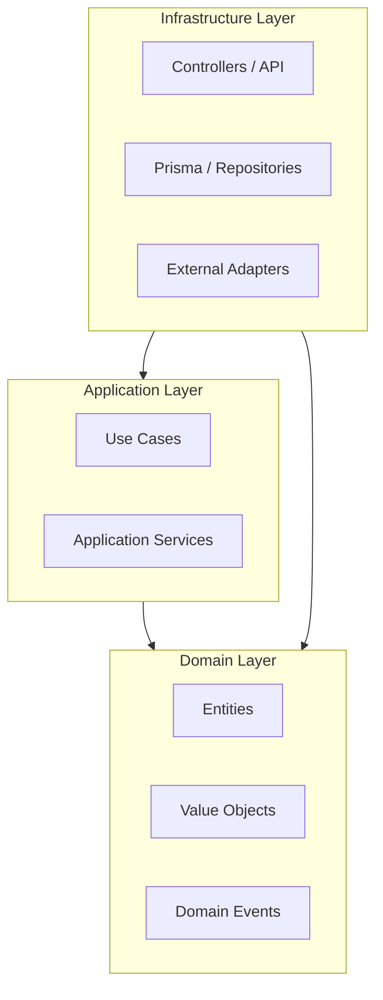

<div align="center">
  <h1>OneJs Boilerplate</h1>
  <p><b>A modern, type-safe, and feature-rich framework for enterprise-grade web applications.</b></p>

  <p>
    
    
    
    
    
  </p>

  <h4>
    <a href="docs/README.md">Documentation</a>
    <span> · </span>
    <a href="https://github.com/your-username/eyjs-boilerplate/issues">Report Bug</a>
    <span> · </span>
    <a href="https://github.com/your-username/eyjs-boilerplate/pulls">Request Feature</a>
  </h4>
</div>

---

OneJs is a high-performance boilerplate built on top of **Elysia.js** and **Bun**, implementing **Hexagonal Architecture** and **Domain-Driven Design (DDD)**. It provides a robust foundation for building scalable, maintainable, and type-safe backend services.

## ✨ Key Features

- 🚀 **Extreme Performance** - Leverages Bun's runtime and Elysia's optimized router.
- 🏗️ **Architectural Excellence** - Strict Hexagonal Architecture and DDD principles.
- 💉 **Powerful DI** - Built-in Dependency Injection container with decorator support.
- 📡 **Event-Driven** - Seamless communication using a built-in Event Bus.
- 👷 **Background Processing** - Managed background tasks with BullMQ & Redis.
- 🛡️ **Built-in Security** - JWT and Clerk authentication strategies out of the box.
- 🗄️ **Schema Harmony** - Automated Prisma schema merging for multi-module projects.

## 🛠️ Tech Stack

| Category | Technology |
| :--- | :--- |
| **Runtime** | [Bun](https://bun.sh/) |
| **Web Framework** | [Elysia.js](https://elysiajs.com/) |
| **Database/ORM** | [PostgreSQL](https://www.postgresql.org/) & [Prisma](https://www.prisma.io/) |
| **Task Queue** | [BullMQ](https://docs.bullmq.io/) & [Redis](https://redis.io/) |
| **Code Quality** | [Biome](https://biomejs.dev/) |
| **Environment** | [Docker](https://www.docker.com/) / [Podman](https://podman.io/) |

## 🏗️ Architecture at a Glance

OneJs enforces a clear separation of concerns, ensuring your domain logic remains pure and decoupled from infrastructure details.



## 🚀 Quick Start

1. **Clone & Install**
   ```bash
   git clone <repository-url>
   cd eyjs-boilerplate
   bun install
   ```

2. **Initialize Your Project**
   ```bash
   bun run init
   ```
   *Follow the interactive prompts to choose which components (API, Admin, Worker) and examples you want to keep. This will clean up the boilerplate for your specific needs.*

3. **Launch Dev Environment**
   ```bash
   bun start:api:dev
   ```
   *This starts the DB, merges schemas, runs migrations, and launches the server.*

## 🛠️ Usage & Scaffolding

### Project Templates
OneJs supports different application types that you can choose during `bun run init`:
- **API**: High-performance backend using Elysia.js.
- **Admin**: Modern dashboard built with Next.js and Shadcn UI.
- **Worker**: Background task processor using BullMQ and Redis.

## 📖 Documentation

Explore our comprehensive guides to master OneJs:

- [**Overview & Setup**](docs/getting-started.md)
- [**Hexagonal Architecture Deep Dive**](docs/architecture.md)
- [**Dependency Injection & Core**](docs/core-features.md)
- [**Routing & Controllers**](docs/routing.md)
- [**Database & Persistence**](docs/database.md)
- [**Events & Background Jobs**](docs/events-jobs.md)
- [**Authentication & Security**](docs/auth.md)

## 🤝 Contributing

Contributions are what make the open-source community such an amazing place to learn, inspire, and create. Any contributions you make are **greatly appreciated**.

1. Fork the Project
2. Create your Feature Branch (`git checkout -b feature/AmazingFeature`)
3. Commit your Changes (`git commit -m 'Add some AmazingFeature'`)
4. Push to the Branch (`git checkout -b feature/AmazingFeature`)
5. Open a Pull Request

## 📄 License

Distributed under the MIT License. See `LICENSE` for more information.
