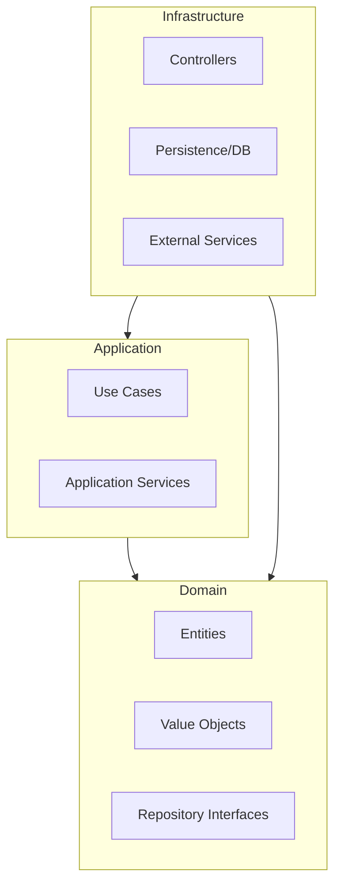

# Architecture

OneJs is built on the principles of **Hexagonal Architecture** (also known as Ports and Adapters) and **Domain-Driven Design (DDD)**. This ensures that the core business logic is decoupled from external technical details like databases, UI, or external APIs.

## Project Structure

The boilerplate is organized into three main areas:

-   `apps/`: Entry points for runnable applications (e.g., `api`, `notifications`).
-   `packages/`: Bounded contexts holding domain logic (e.g., `user`, `task`, `shared`).
-   `.oneJs/`: The framework workspace — DI container, server, auth, event bus, jobs, prisma, testing.

## Hexagonal Layers

Each module in `packages/` is typically structured into three layers:

### 1. Domain Layer (`domain/`)
The heart of your application. It contains the business rules and logic.
-   **Entities**: Domain objects with identity (e.g., `User`, `Post`).
-   **Value Objects**: Objects defined by their attributes (e.g., `Email`, `Id`).
-   **Domain Events**: Events that signify something important happened in the domain (e.g., `UserCreatedEvent`).
-   **Repositories (Interfaces)**: Contracts for data persistence.
### 2. Application Layer (`application/`)
Orchestrates the domain logic to fulfill specific use cases.
-   **Services**: Application services with a single `run()` entry point (e.g., `UserCreator`, `UserAuthenticator`).
-   **DTOs**: Data Transfer Objects at the persistence boundary (`toDto()` / `reconstitute()`).
-   **Dependency injection**: `@Injectable()` on the service, `@Inject(ConcreteClass)` on constructor params.

### 3. Infrastructure Layer (`infrastructure/`)
Contains the concrete implementations of the interfaces defined in the domain and application layers.
-   **Controllers**: Handle incoming HTTP requests and map them to use cases.
-   **Persistence**: Concrete repository implementations (e.g., `UserPrismaRepository`, `InMemoryUserRepository`).
-   **External Adapters**: Clients for external services (e.g., Email providers, Payment gateways).

## Dependency Flow

In Hexagonal Architecture, the dependency direction always points **inward** toward the Domain layer.

By following this pattern, you can swap adapters (e.g., replace the InMemory repository with a Prisma one, or change the HTTP framework) without touching your core business logic.

