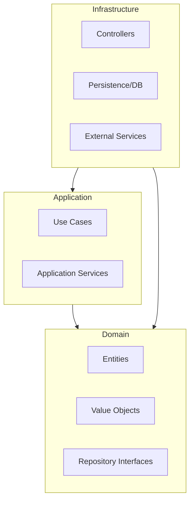

# Architecture

OneJs is built on the principles of **Hexagonal Architecture** (also known as Ports and Adapters) and **Domain-Driven Design (DDD)**. This ensures that the core business logic is decoupled from external technical details like databases, UI, or external APIs.

## Project Structure

The boilerplate is organized into three main areas:

-   `apps/`: Contains the entry points for your applications (e.g., `api`, `admin`).
-   `packages/`: Contains domain-specific modules (e.g., `user`, `post`). This is where the core logic lives.
-   `.oneJs/`: The framework core, containing the DI container, server setup, and plugin system.

## Hexagonal Layers

Each module in `packages/` is typically structured into three layers:

### 1. Domain Layer (`domain/`)
The heart of your application. It contains the business rules and logic.
-   **Entities**: Domain objects with identity (e.g., `User`, `Post`).
-   **Value Objects**: Objects defined by their attributes (e.g., `Email`, `Id`).
-   **Domain Events**: Events that signify something important happened in the domain (e.g., `UserCreatedEvent`).
-   **Repositories (Interfaces)**: Contracts for data persistence.
-   **DTOs**: Data Transfer Objects for passing data between layers.

### 2. Application Layer (`application/`)
Orchestrates the domain logic to fulfill specific use cases.
-   **Use Cases**: Specific actions a user can perform (e.g., `CreateUserUseCase`).
-   **Services**: Application-wide logic that doesn't belong in a single entity.

### 3. Infrastructure Layer (`infrastructure/`)
Contains the concrete implementations of the interfaces defined in the domain and application layers.
-   **Controllers**: Handle incoming HTTP requests and map them to use cases.
-   **Persistence**: Concrete repository implementations (e.g., `PrismaUserRepository`, `MongoUserRepository`).
-   **External Adapters**: Clients for external services (e.g., Email providers, Payment gateways).

## Dependency Flow

In Hexagonal Architecture, the dependency direction always points **inward** toward the Domain layer.

By following this pattern, you can change your database (e.g., from Mongo to Prisma) or your web framework without touching your core business logic.

